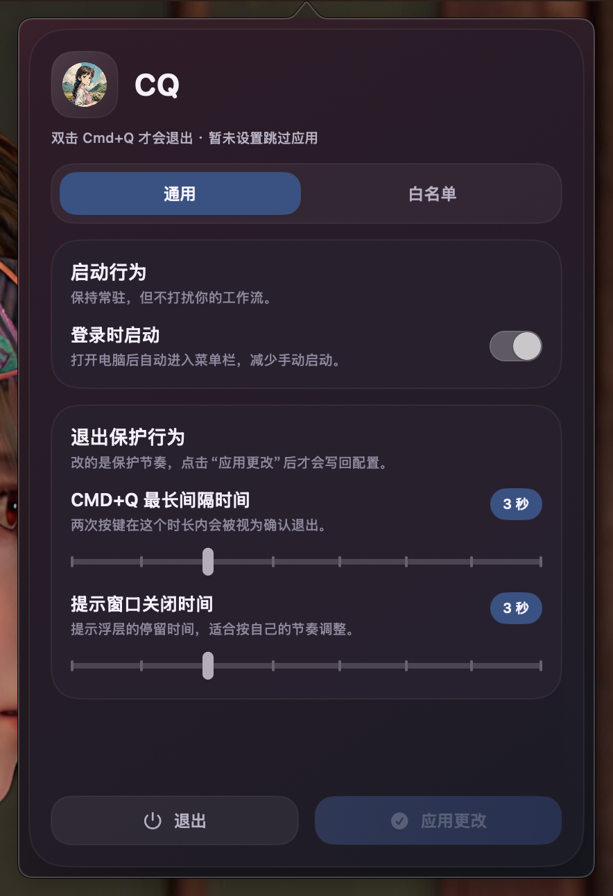
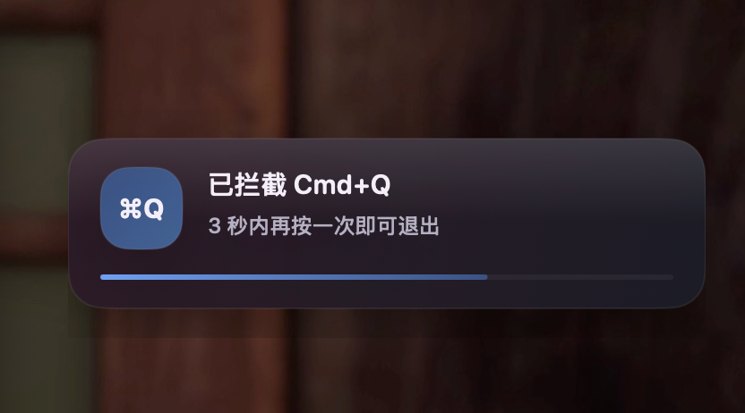

# CQ

CQ 是一个 macOS 菜单栏工具，用来拦截误触的 `Cmd + Q`。

默认情况下，按下一次 `Cmd + Q` 不会立刻退出应用；只有在设定时间内再次触发，才会真正退出。这样可以在日常工作里减少误关应用的情况。

## 功能

- 拦截单次 `Cmd + Q`
- 支持双击确认退出
- 支持登录时启动
- 支持白名单应用跳过二次确认
- 支持在菜单栏面板内直接调整常用设置

## 使用方式

1. 启动应用后，图标会常驻在菜单栏。
2. 点击菜单栏图标，打开设置面板。
3. 根据需要调整退出确认时间、提示停留时间或白名单应用。
4. 一般保持默认设置即可。

## 界面预览

菜单栏界面

触发弹窗

